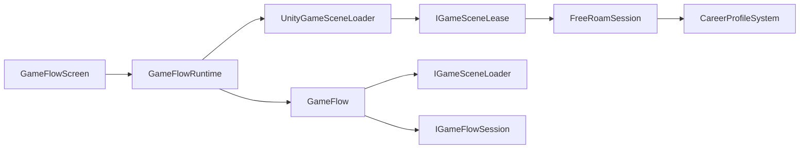
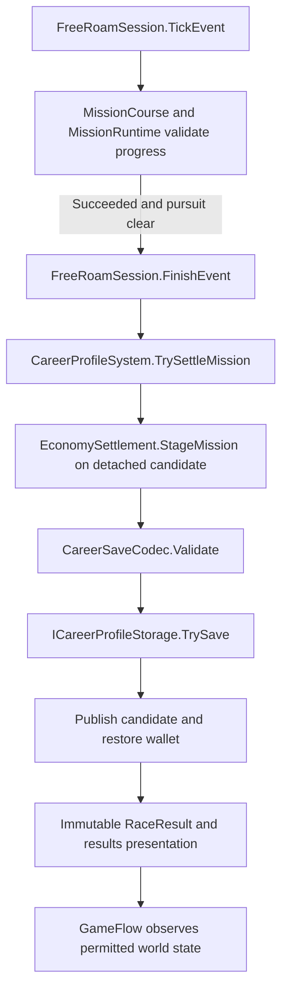

# Driving runtime architecture

Date: 2026-09-08. This document records the verified architecture of the current `Assets/NfsMw/Modules/Driving` implementation and the first completed decoding from the residual `NfsMwRemaster.Driving` assembly. It is an implementation record, not a request to recreate a folder diagram. Current source, assembly definitions, serialized assets, and executed tests take precedence over older design documents.

The migration rule is deliberately narrow: move one cohesive responsibility only after its members, consumers, lifecycle, saved-data effects, and tests are known. Keep the residual assembly explicit until each later decoding can meet the same proof standard. No empty feature directories, placeholder services, second state machines, or speculative ports are part of this change.

## Implemented boundary

`GameFlow` and its three small session/scene contracts now form the Unity-free `NfsMwRemaster.Driving.GameFlow` assembly. Unity composition remains in the residual runtime:



The dependency arrows above show which code knows which API. The loaded world remains responsible for gameplay and career behavior; `GameFlow` only validates and sequences application transitions.

### Responsibility owner before and after

| Responsibility | Before | After |
| --- | --- | --- |
| Legal application states, command gate, scene-transition sequence, active scene lease | `GameFlow.cs` inside `NfsMwRemaster.Driving` | `GameFlow.cs` inside `NfsMwRemaster.Driving.GameFlow` |
| Unity startup, input, pause presentation, timeout, and composition | `GameFlowRuntime` inside `NfsMwRemaster.Driving` | Unchanged in `NfsMwRemaster.Driving` |
| Additive Unity scene load, activation, drain-on-cancel, and unload | `UnityGameSceneLoader` inside `NfsMwRemaster.Driving` | Unchanged in `NfsMwRemaster.Driving`; implements the decoded port |
| World validation, career initialization, race commands, and save-for-exit | `FreeRoamSession` inside `NfsMwRemaster.Driving` | Unchanged in `NfsMwRemaster.Driving`; implements the decoded session port |
| Rewards, progression, wallet changes, and profile persistence | Mission, economy, career, and storage implementations inside `NfsMwRemaster.Driving` | Unchanged; the GameFlow assembly has no reward or persistence API |

This is a real compile-time boundary: [NfsMwRemaster.Driving.GameFlow.asmdef](Runtime/GameFlow/Core/NfsMwRemaster.Driving.GameFlow.asmdef) has no references and has `noEngineReferences: true`. The core source imports only `System`, `System.Threading`, and `System.Threading.Tasks`.

### Exact assembly membership and references

The machine-readable baseline was captured before creating the new assembly definitions:

- [assembly-membership-before.tsv](../../Tools/ArchitectureValidation/Evidence/assembly-membership-before.tsv) maps every inspected C# file to its nearest owning assembly: 492 files in 25 assemblies.
- [assembly-references-before.json](../../Tools/ArchitectureValidation/Evidence/assembly-references-before.json) records all 25 assembly definitions and their direct references.
- [assembly-membership-after.tsv](../../Tools/ArchitectureValidation/Evidence/assembly-membership-after.tsv) and [assembly-references-after.json](../../Tools/ArchitectureValidation/Evidence/assembly-references-after.json) are the delivered post-decoding snapshots: 525 files in 28 assemblies. They include concurrent Audio Analysis work; the evidence README separates those additions from this decoding.

The architectural membership change is exact:

```text
Assets/NfsMw/Content/Frontend/UI/Runtime/Core/GameFlow.cs
    NfsMwRemaster.Driving
        -> NfsMwRemaster.Driving.GameFlow

Assets/NfsMw/Modules/Driving/Tests/Editor/GameFlowTests.cs
    NfsMwRemaster.Driving.Tests
        -> NfsMwRemaster.Driving.GameFlow.Tests
```

The production source moved to `Runtime/GameFlow/Core/GameFlow.cs`; the test moved to `Tests/GameFlow/GameFlowTests.cs`. Other additions visible in the post-decoding membership snapshot came from concurrent workspace work and are listed separately by the evidence README.

The changed direct references are:

```text
BEFORE
NfsMwRemaster.Driving
    -> NfsMwRemaster.Driving.Contracts
    -> Unity.InputSystem

NfsMwRemaster.Driving.Editor
    -> NfsMwRemaster.Driving.Rendering.Runtime
    -> NfsMwRemaster.Driving.Contracts
    -> NfsMwRemaster.City.Clipper2.Editor
    -> NfsMwRemaster.Driving
    -> NfsMwRemaster.Lighting
    -> NfsMwRemaster.Driving.Roads.Authoring
    -> Unity.Splines
    -> Unity.Splines.Editor
    -> Unity.InputSystem
    -> Unity.RenderPipelines.Core.Runtime
    -> Unity.RenderPipelines.HighDefinition.Runtime
    -> Unity.RenderPipelines.HighDefinition.Editor

NfsMwRemaster.Driving.Tests
    -> NfsMwRemaster.Driving.Contracts
    -> NfsMwRemaster.Driving
    -> NfsMwRemaster.Driving.Roads.Authoring
    -> Unity.Splines
    -> NfsMwRemaster.Driving.Editor
    -> NfsMwRemaster.Driving.PhysicsLab.Editor
    -> NfsMwRemaster.Driving.Missions.Editor
```

```text
AFTER
NfsMwRemaster.Driving.GameFlow
    -> no assemblies

NfsMwRemaster.Driving.GameFlow.Tests
    -> NfsMwRemaster.Driving.GameFlow

NfsMwRemaster.Driving
    -> NfsMwRemaster.Driving.Contracts
    -> NfsMwRemaster.Driving.GameFlow
    -> Unity.InputSystem

NfsMwRemaster.Driving.Editor
    -> NfsMwRemaster.Driving.Rendering.Runtime
    -> NfsMwRemaster.Driving.Contracts
    -> NfsMwRemaster.Driving.GameFlow
    -> NfsMwRemaster.City.Clipper2.Editor
    -> NfsMwRemaster.Driving
    -> NfsMwRemaster.Lighting
    -> NfsMwRemaster.Driving.Roads.Authoring
    -> Unity.Splines
    -> Unity.Splines.Editor
    -> Unity.InputSystem
    -> Unity.RenderPipelines.Core.Runtime
    -> Unity.RenderPipelines.HighDefinition.Runtime
    -> Unity.RenderPipelines.HighDefinition.Editor

NfsMwRemaster.Driving.Tests
    -> NfsMwRemaster.Driving.Contracts
    -> NfsMwRemaster.Driving.GameFlow
    -> NfsMwRemaster.Driving
    -> NfsMwRemaster.Driving.Roads.Authoring
    -> Unity.Splines
    -> NfsMwRemaster.Driving.Editor
    -> NfsMwRemaster.Driving.PhysicsLab.Editor
    -> NfsMwRemaster.Driving.Missions.Editor
```

No temporary assembly dependency was introduced. The residual runtime's dependency on GameFlow is the intended direction because its Unity adapters implement GameFlow ports. The Editor and main test assemblies have direct references because their existing builders, smoke checks, and integration tests consume the decoded API. The dedicated GameFlow test assembly depends only on the core under test.

The local assembly graph is checked for cycles by `DrivingArchitectureTests.DrivingAssemblyGraphRemainsAcyclic`. It also checks that the decoded core is Unity-free, the isolated test assembly has one dependency, and all three direct consumers declare GameFlow explicitly.

### Public API

The decoded assembly exposes only the application-flow surface already used by the repository:

- `GameFlowState` and `GameFlowCommand` describe legal shell state and commands.
- `FlowResult` reports a successful or rejected command without throwing for expected rejection.
- `IGameFlowSession` exposes world state, career initialization, command execution, and save-for-exit.
- `IGameSceneLease` exposes the loaded session, activation, and asynchronous unload.
- `IGameSceneLoader.LoadAsync` reports progress and accepts cancellation. Its contract requires an adapter to drain the engine load and release a partially loaded scene before completing after failure or cancellation.
- `GameFlow` owns boot completion, career entry, command serialization, return to menu, active lease, failure state, and change notification.
- `SceneTransitionCleanupException` marks cleanup failure so the flow can fail closed in `Faulted` rather than start another load.

The namespace remains `NfsMwRemaster.Driving`, so consumers did not need type or serialized-name rewrites. `GameFlow` does not expose Unity objects, concrete career services, storage implementations, or reward fields.

### Lifetime and cleanup

`GameFlowRuntime` is the application owner. Unity creates it once, it survives scene loads, and it owns the application cancellation source, the optional runtime-created settings object, the screen component, the `GameFlow.Changed` subscription, and the pause/cursor state it changes. `OnDestroy` cancels and disposes the token source, removes the subscription, restores simulation state, clears the singleton, and destroys only settings it created.

`GameFlow` owns one active `IGameSceneLease`. A candidate lease is not published until its session initializes and the scene activates. If initialization or cancellation fails after load, the candidate is unloaded before another load can begin. Cleanup failure moves the flow to `Faulted`. Return to menu asks the world to save before unloading. A failed save leaves the world and its current state intact; a failed unload keeps the session available for recovery.

`UnityGameSceneLoader` is the Unity adapter. Unity scene operations cannot be cancelled mid-operation, so it drains the additive load, checks cancellation, finds exactly one enabled `FreeRoamSession`, and unloads the scene on failure. Its lease owns the loaded scene only.

`FreeRoamSession` remains the world-session owner. It owns the active mission course, navigation route, police subscription, vehicle hold state, and world-scoped bindings. `OnDisable` unsubscribes from police, restores pause and vehicle state, and disposes the mission course. Career/profile services keep their verified current lifetime on the world object; this decoding does not shorten or duplicate that lifetime.

## Worked runtime proof: completing a race

The existing implementation already provides the cross-feature settlement workflow. A new `RaceSettlementWorkflow` wrapper would add indirection without changing ownership, so none was introduced.



The actual responsibility split is:

| Step | Owner | Guarantee |
| --- | --- | --- |
| Checkpoint order, elapsed time, objective outcome, and stable attempt claim | `MissionCourse` / `MissionRuntime` | Only a succeeded mission reaches settlement. A restored snapshot retains its claim ID. |
| Event/world coordination | `FreeRoamSession.TickEvent` and `FinishEvent` | Waits for pursuit resolution, requests settlement, retains a pending success when settlement fails, and only then publishes `RaceResult`. |
| Reward and duplicate policy | `EconomySettlement.StageMission` | Applies mission economics to a detached profile candidate and records the claim in the same candidate. An existing claim makes redelivery idempotent. |
| Coherent profile capture | `CareerProfileSystem` | Clones the current profile, captures all profile and active-vehicle participants, stages the mission, serializes, and validates before storage. |
| Durable write and recovery | `ICareerProfileStorage`; currently `JsonCareerProfileStorage` / `CareerSaveRepository` | The concrete adapter owns files, generation recovery, optimistic head stamps, and uncertain-commit handling. Career only receives the storage port. |
| Wallet publication | `CareerProfileSystem` | Replaces current runtime state and restores the wallet only after the staged JSON is durably acknowledged or an uncertain write is confirmed by an exact read-back. |
| Result presentation and global transition | `FreeRoamSession`, `GameFlowScreen`, `GameFlow` | Results contain event, outcome, elapsed time, cash, persistence message, and settlement ID. GameFlow observes state and does not award money. |

Repeated delivery and failure behavior are explicit:

- `MissionRuntime.Capture().claimId` is the stable settlement identity. The claim and resulting wallet/progression changes are written in one profile payload.
- A rejected save does not replace `currentProfile` and does not restore the candidate wallet. `FreeRoamSession` keeps the succeeded course active, reports settlement pending, and throttles explicit retries for two seconds.
- An exception with an uncertain commit is confirmed by loading and comparing the exact serialized candidate. If it cannot be confirmed, career saving fails closed until reload.
- After successful settlement, `FreeRoamSession` captures the completed-event/world state with its ordinary save. Failure of this second save is shown in the result message; the already acknowledged reward settlement remains durable.
- Abandoning an event calls `Fail`, producing an aborted attempt without settlement. Restart aborts the old course and creates a fresh claim. A restored active race retains its old claim until the player restarts it.
- Return to menu saves the mission snapshot and resume pose before scene unload. Event preparation and active pursuits block exit where safe reconstruction is unavailable.

This mapping preserves direct, small APIs. Race rules never open save files, career rules never depend on `CareerSaveRepository`, presentation never changes wallet fields, and GameFlow never depends on `FreeRoamSession` as a concrete type.

## Worked extension proof: adding a vehicle module

The current vehicle seam already supports the requested extension path, so the pipeline was tested instead of replaced.

`VehicleModuleHost` discovers `IVehicleModule` components once during configuration. It sorts by `ExecutionOrder`, then ordinal `ModuleId`, and initializes every module with one shared `VehicleModuleContext`. `VehicleController` calls the established phases:

```text
Fixed-step input -> IVehiclePrePhysicsModule.BeforePhysics
Wheel/assist work -> IVehiclePostPhysicsModule.AfterPhysics
Updated telemetry -> IVehiclePresentationModule.Present
```

The context exposes the vehicle, body, current tuning, wheels, input, and telemetry, plus an explicit tuning replacement and reconfiguration request. A new module can participate without changing GameFlow, FreeRoam, maps, police, or storage.

Persisted module state uses `ICareerVehicleStateParticipant`. `CareerProfileSystem` discovers participants, scopes them to the active `CareerVehicleData`, and invokes `Capture` and `Restore`. Modules never read or write save files. The existing performance and customization modules prove the route:

- `VehiclePerformanceSystem`: `ModuleId = "performance"`, order `-1000`, persists `performanceUpgradeIds`, resolves them through `VehiclePerformanceCatalog`, and requests a vehicle reconfiguration after restore.
- `VehicleCustomizationSystem`: `ModuleId = "customization"`, order `-900`, persists `customizationIds`, resolves them through `VehicleCustomizationCatalog`, and applies its existing visual adapter.

Both remain in the residual assembly because separating the whole vehicle feature would currently cross controller, tuning, Unity physics, career participant, catalog, store, authoring, and prefab serialization boundaries. Creating an assembly around only the two tested classes would produce a cosmetic boundary and circular pressure.

## Serialization and saved-data compatibility

The move preserved both Unity `.meta` identities:

```text
GameFlow.cs      d74ecce02621e4749b3dac5a2802bd69
GameFlowTests.cs 7feda3841a23d4fbf936f6ad4ddebed3
```

No non-meta asset references either GUID. No scene, prefab, ScriptableObject, published data, or save schema moved. The namespace and public type names are unchanged. The production file contains no `MonoBehaviour`, `ScriptableObject`, or serialized field, so the new assembly boundary does not add a serialized component identity.

Race restoration is exercised through a `JsonUtility` round trip and `CareerSaveCodec.Validate`; checkpoint progress and claim identity survive. Restarting the restored race aborts that attempt and creates a new claim. Vehicle module restoration is also exercised through a `JsonUtility` round trip using the existing `CareerVehicleData` fields and real catalogs.

The round-trip test exposed two existing compatibility defects. Unity materializes a default `CareerWeatherData` when an optional inline object is absent, while its three nested snapshot structs previously defaulted to zero-metre visibility. Their field initializers now use canonical clear-weather values. The same payload then exposed culture-dependent validation: `CareerSaveCodec.Float` converted an already numeric JSON token to current-culture text and reparsed it as invariant text, rejecting the first non-integer value on this editor. It now reads the numeric token directly. Neither fix changes the schema or overwrites authored weather data, and the final race snapshot round trip passes strict validation.

## Residual assembly and next decoding sequence

`NfsMwRemaster.Driving` remains a documented residual assembly. At the post-decoding snapshot it owns 221 C# files. It contains the Unity composition root and several gameplay features whose current dependencies are still intertwined. That size is migration evidence, not permission for a mass move.

Existing useful boundaries remain in place: Unity-free driving contracts, rendering runtime, Roads authoring, Lighting, Maps, Diagnostics, their editor adapters, and their focused test assemblies. Runtime-compatible publication and authoring data must stay reachable by player code even when editor execution moves elsewhere.

Use this order for each later decoding:

1. Capture the current membership and direct-reference graph before editing.
2. Select one feature whose actual public surface and Unity boundary are already visible.
3. Enumerate every direct consumer, serialized component, asset GUID, lifecycle owner, persistence field, editor tool, and focused test for that feature.
4. Decide whether its public API belongs in the feature assembly or whether a separate contract assembly solves a demonstrated dependency problem.
5. Move a complete cohesive unit with its `.meta` files, add only references required by compiled consumers, and reject any edge that closes a cycle.
6. Compile the production assembly and its direct consumers, execute feature, integration, failure, and serialization tests, and update the evidence snapshots.
7. Remove the corresponding files and obsolete reference from the residual assembly only when the feature no longer depends back on residual implementation details.

Likely candidates must be re-audited at the time of decoding. Mission/race rules and career persistence are currently useful seams, but their direct coordination still lives in `FreeRoamSession` and `CareerProfileSystem`. Vehicles currently have a strong module API but a wide Unity and persistence surface. Traffic, pursuit, city streaming, and roads share live world and route types. Their names alone do not justify new assemblies.

The following directions remain prohibited:

```text
Feature implementation -> GameFlowRuntime or another composition root
GameFlow core          -> FreeRoamSession, UnityEngine, Input System, or HDRP
Career rules           -> JsonCareerProfileStorage or CareerSaveRepository
Race/mission rules     -> concrete profile files
Runtime assembly       -> Editor assembly
Any assembly           -> a dependency that closes a cycle
```

## Verification record

| Evidence | Scope | Result |
| --- | --- | --- |
| Unity compilation | Decoded core and tests plus residual runtime, editor, and test consumers | Passed under Unity 6000.6.0f1. The final post-cleanup batch run exited 0 with no C# compilation errors. |
| Static assembly checks | GameFlow references, engine independence, direct consumers, and all local Driving asmdef cycles | 5/5 `DrivingArchitectureTests` passed. |
| GameFlow tests | boot, successful load, reentrancy, cancellation cleanup, cleanup failure, retry, failed save, unload failure, broken observers, and race-phase observation | 13/13 isolated `NfsMwRemaster.Driving.GameFlow.Tests` tests passed. |
| Race settlement | failed save, retry, duplicate delivery, wallet result, persisted claim, and codec validation | The focused settlement failure/retry test passed; the related FreeRoam and GameFlow failure paths also passed. |
| Recovered race | JSON round trip, progress/claim restoration, and restart with a new claim | Both restoration assertions passed within 13/13 `FreeRoamSessionTests`. |
| Vehicle module seam | deterministic ordering, all three phases, shared input/telemetry, 2,000 warmed dispatches, allocation delta, and real module restoration | 3/3 passed; the warmed dispatch loop reported zero managed-thread allocation. |
| Save compatibility | optional default weather plus non-integer pursuit and cooldown values while the editor thread uses `fr-FR` | The focused culture regression passed without changing the save schema. |

The final focused result is 36 passed, 0 failed, 0 skipped. Its XML, execution log, the clean compilation log, hashes, and remaining uncertainty are recorded beside the assembly snapshots in [Tools/ArchitectureValidation](../../Tools/ArchitectureValidation/README.md). This decoding does not claim a full player build, PlayMode scene traversal, or full-project test pass until those checks are actually run.
